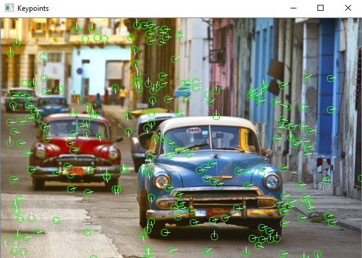

# SIFT-algo-self

<p>The following repo is an attempt on writing the SIFT algorithm used in Computer Vision, from scratch. It is purposefully written in C++ due to speed and efficiency considerations, and also in light of the fact that all the original <strong>openCV</strong> bindings have been created in C++. The final images have also been made available in the following README as examples.</p>

## Optimizations achieved:
- Vectors employed instead of arrays, which made allocation and working of the program smoother and also reducing the lines of code.
- Usage of the latest and newest openCV 4.3 syntax. Thus the following code doesn't use any kind of pointers unlike the past syntax and working.
- Reduction in number of lines of code due to above 2 points
- Significant improvement in boundary conditions along with usage of ```Mat.at<float>(Point(x,y))``` for accessing each and every pixel of the ```Mat```.

## Examples:

### EXPLAINATION:
The lines which look like the radius of the circle actually represent the orienation of that particular **Keypoint**.

#### Original Image 1:


#### Program Output 1:


#### Original Image 2:


#### Program Output 2:


